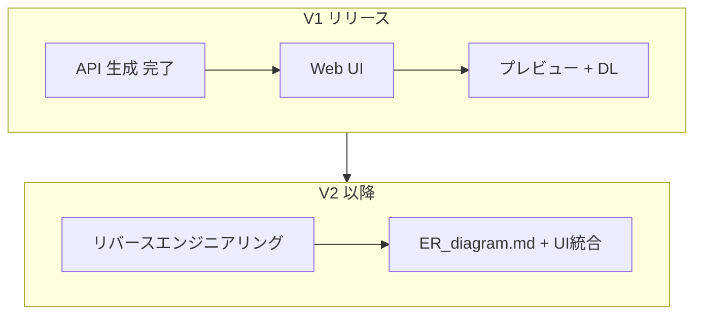

# 開発計画 (2026-06-05)

作成日: 2026-06-05  
**V1 定義（正）:** [v1_release.md](./v1_release.md)

## 方針

| 優先 | 内容 |
|------|------|
| **最優先** | V1: Web UI + 要望入力から SQL/Prisma 取得まで |
| **後回し** | リバースエンジニアリング、ER 図、ファイルアップロード → **V2** |

---

## 1. 達成状況

### 完了（V1 の前提）

- [x] Fastify + TypeScript サーバー
- [x] Gemini 連携スキーマ生成
- [x] `output/schema.sql`, `output/schema.prisma` 書き出し
- [x] `POST /generate`

### V1 残タスク

- [x] `public/` Web UI（要望入力・プレビュー・DL）
- [x] Fastify 静的配信
- [x] API レスポンス `files` 形式（UI 向け）
- [x] 起動時 / リクエスト時の `GEMINI_API_KEY` チェック（最低限）
- [x] README（V1 手順）

---

## 2. V1 実装チェックリスト

参照: [ui_requirements.md](./ui_requirements.md)

- [x] 要望入力 + 生成ボタン + バリデーション
- [x] ローディング / エラー / 成功表示
- [x] SQL・Prisma プレビュー
- [x] 個別ダウンロード（Must）
- [ ] ZIP 一括（Should・余力時）
- [ ] V1 受け入れ条件をすべて満たす（実機確認・API キー設定後）

**V1 でやらないこと**

- [ ] SQL / Prisma パーサー（リバースエンジニアリング）
- [ ] Mermaid ER 図 / `ER_diagram.md`
- [ ] ファイルアップロード UI
- [ ] `src/core/parser` 等の大規模分割（V1.1 / V2）

---

## 3. V2 以降（リバースエンジニアリングはここ）

### V2: 解析と可視化

- [ ] 既存 `.sql` / `.prisma` → 中間 JSON（パーサー）
- [ ] 中間表現 → Mermaid → `ER_diagram.md`
- [ ] UI: ファイルアップロード、ER プレビュー・DL

### V3: 堅牢化・拡張

- [ ] `src/` ディレクトリ整理（generator / parser / visualizer 分離）
- [ ] AI 応答バリデーション強化
- [ ] 修正依頼による再生成
- [ ] 追加 ORM フォーマット

---

## 4. リリース順序

1. **V1** — 画面完結の新規生成フローをリリース
2. **V2** — リバースエンジニアリング + ER 図
3. **V3** — 品質・拡張機能
