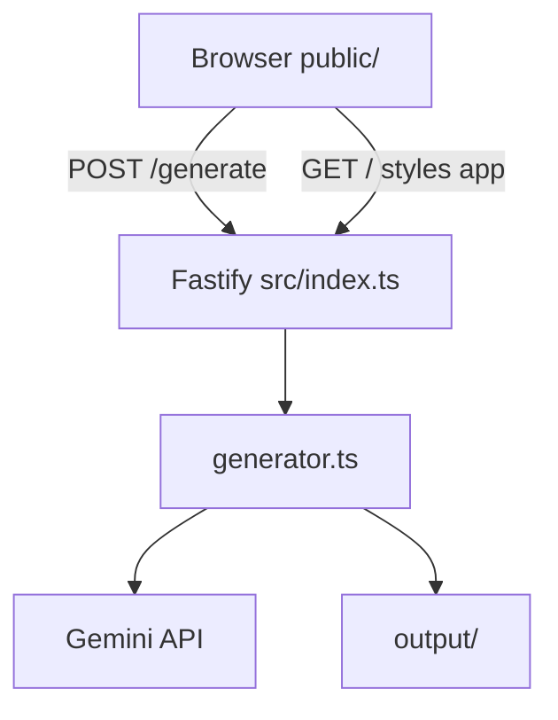

# V1 実装設計 (@Structural)

作成日: 2026-06-05  
参照: [v1_release.md](./v1_release.md)

## 1. アーキテクチャ（V1）



- **単一ポート**（既定 3000）で UI と API を提供
- 静的ファイルは `@fastify/static` なしで `public/` を直接読み込み（依存最小化）
- ビジネスロジックは `src/core/generator.ts` に分離（V1 最小分割）

## 2. エンドポイント

| メソッド | パス | 役割 |
|----------|------|------|
| GET | `/` | `index.html` |
| GET | `/styles.css`, `/app.js` | 静的アセット |
| GET | `/api/health` | ヘルスチェック |
| POST | `/generate` | スキーマ生成 |

## 3. API 契約

### POST /generate

**Request:** `{ "prompt": string }`（trim 後 1 文字以上）

**Success (200):**

```json
{
  "message": "スキーマを生成しました",
  "files": [
    { "name": "schema.sql", "content": "..." },
    { "name": "schema.prisma", "content": "..." }
  ]
}
```

**Errors:**

| コード | 条件 |
|--------|------|
| 400 | prompt 空 |
| 503 | `GEMINI_API_KEY` 未設定 |
| 500 | AI 失敗・応答形式不正 |

## 4. ディレクトリ（実装後）

```text
public/
  index.html
  styles.css
  app.js
src/
  index.ts
  core/generator.ts
  types/schema.ts
output/          # gitignore 推奨
```

## 5. V2 で追加予定（今回未実装）

- `src/core/parser/`
- `src/core/visualizer/`
- `@fastify/static` またはアセットバンドル化の検討
