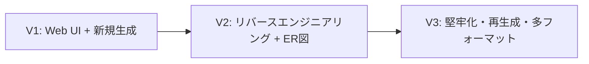

# V1 リリース定義 (@Definition)

作成日: 2026-06-05  
ステータス: **リリース目標の確定版**

## 1. V1 のゴール

> **ブラウザから要望を入力し、AI が生成した `schema.sql` と `schema.prisma` を画面で確認・ダウンロードできる状態をリリースする。**

利用者が curl や CLI を使わず、一連の操作を Web 上で完結できることを V1 の成功基準とする。

---

## 2. スコープ一覧

### V1 に含める（Must）

| ID | 機能 | 説明 |
|----|------|------|
| V1-GEN | AI スキーマ生成 | 要望テキスト → SQL DDL + Prisma（既存 `POST /generate`） |
| V1-UI-IN | 要望入力画面 | 複数行テキスト、バリデーション、生成ボタン |
| V1-UI-STATE | 状態表示 | ローディング、成功、失敗（日本語メッセージ） |
| V1-UI-PREVIEW | 結果プレビュー | `schema.sql` / `schema.prisma` の内容表示 |
| V1-UI-DL | ファイル取得 | 個別ダウンロード（2ファイル）。ZIP は Should |
| V1-API | API 整合 | UI はサーバー API 経由のみ。API キーはサーバー保持 |
| V1-OUT | サーバー保存 | `output/` への書き出し（既存動作を維持） |

### V1 に含めない（Won't — 後続バージョン）

| 機能 | 理由 | 想定バージョン |
|------|------|----------------|
| **リバースエンジニアリング**（既存 SQL/Prisma の読込・解析） | V1 は「新規生成」に集中。パーサー実装コストが大きい | V2 以降 |
| **ER 図（`ER_diagram.md`）** | パーサー / Visualizer 依存。生成フローとは独立 | V2 以降 |
| 既存ファイルのアップロード UI | リバースエンジニアリングとセット | V2 以降 |
| ユーザー認証 | ローカル / 単一利用想定 | 将来 |
| 生成履歴の DB 保存 | V1 はステートレスで十分 | 将来 |
| 修正依頼による再生成 | フィードバックループ | V2 以降 |
| TypeORM / Drizzle 等の追加出力 | マルチフォーマット拡張 | 将来 |
| `src/` の大規模リファクタ（clean 分割） | リリース速度優先。最小変更で UI を載せる | V1.1 / V2 |

---

## 3. ユーザーストーリー（V1）

1. 利用者はブラウザでアプリを開く
2. 要望（例: 「ECサイト。商品・注文・ユーザー」）を入力する
3. 「生成」を押すと、処理中であることが分かる
4. 成功すると SQL と Prisma が画面に表示される
5. 各ファイルをローカルにダウンロードできる
6. 入力ミスや API エラー時、理由が分かるメッセージが表示される

---

## 4. 成果物（Deliverables）

| 種別 | 成果物 |
|------|--------|
| 実行可能アプリ | `npm run dev` で UI + API が起動 |
| 画面 | `public/` 静的 UI（または同等） |
| 出力ファイル | `schema.sql`, `schema.prisma` |
| ドキュメント | README に V1 の起動・使い方 |

---

## 5. 受け入れ条件（V1 リリース判定）

- [ ] ブラウザから要望を入力して生成できる
- [ ] 生成結果の SQL / Prisma を画面で読める
- [ ] `schema.sql` と `schema.prisma` をダウンロードできる
- [ ] 空入力時に画面でエラーが分かる
- [ ] `GEMINI_API_KEY` 未設定時に分かりやすいエラーが出る
- [ ] README にセットアップ手順がある

**V1 では不要（チェックしない）**

- [ ] 既存 DDL / Prisma ファイルの取り込み
- [ ] `ER_diagram.md` の生成・表示
- [ ] ER 図の Mermaid プレビュー

---

## 6. V1 の技術方針（要件レベル）

| 論点 | V1 での方針 |
|------|-------------|
| フロント | **素の HTML + CSS + JS**（ビルド不要、最速リリース） |
| 配信 | **Fastify から `public/` を静的配信**（単一ポート） |
| 一括 DL | **個別 DL を Must**、ZIP は Should（余力があれば） |
| ER 図 | **V1 対象外**（V2 で Parser + Visualizer と同時に UI 統合） |

詳細 UI 要件: [ui_requirements.md](./ui_requirements.md)

---

## 7. ロードマップ上の位置づけ

| バージョン | テーマ |
|------------|--------|
| **V1（現在）** | 画面から要望入力 → SQL / Prisma 取得 |
| V2 | 既存スキーマ解析、Mermaid ER 図、UI への ER 統合 |
| V3 | 構造整理、バリデーション強化、修正再生成、出力拡張 |

---

## 8. 次のアクション

| 担当 | タスク |
|------|--------|
| @Structural | V1 向け `public/` + Fastify 静的配信・API レスポンス `files` 形式 |
| @Speed | V1 UI 実装と `POST /generate` 連携 |
| @Realistic | V1 受け入れ条件の確認、API キー・エラー表示のレビュー |
